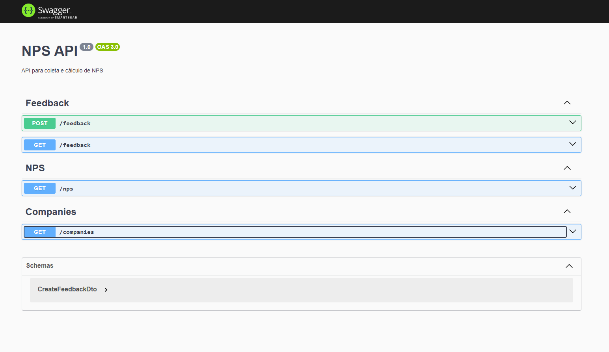
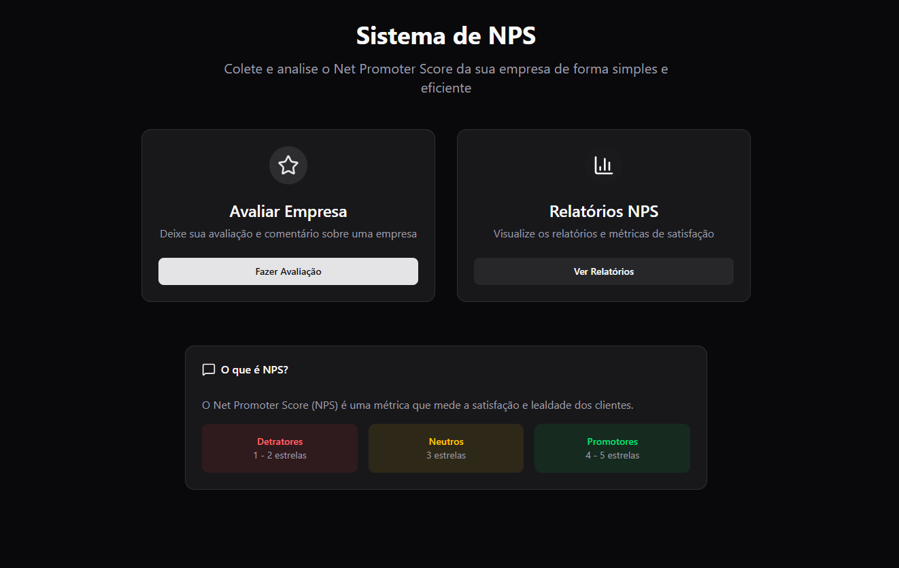
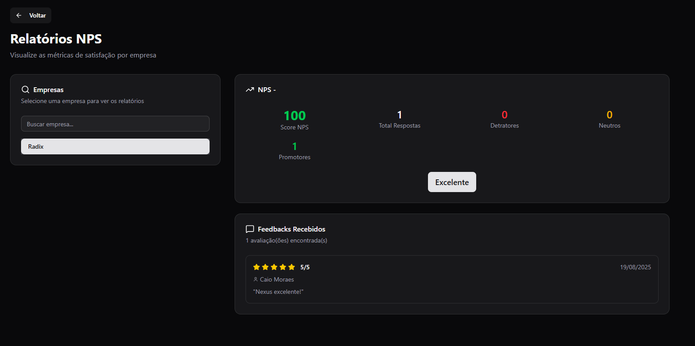

# Sistema de Relatório de NPS

Esta é uma aplicação full-stack projetada para coletar, analisar e exibir dados de NPS de forma intuitiva.

## Visão Geral do Projeto

A aplicação está divida em duas partes principais:

-   **Backend:** API RESTful, construída com **NestJS**, é responsável por toda a lógica de negócio, incluindo o gerenciamento de empresas, a coleta de feedbacks e o cálculo do NPS. Utiliza **Prisma** como ORM para fazer a comunicação tipada com o banco de dados PostgreSQL.


-   **Frontend:** Interface web, desenvolvida com **Next.js** e o App Router. Proporciona uma experiência de usuário fluida para enviar avaliações e visualizar relatórios detalhados de NPS. A estilização é feita com **Tailwind CSS** e componentes **shadcn/ui**.



## Tecnologias e Padrões

### Stack de Tecnologias

| Área      | Tecnologia                                                                                             |
| :-------- | :----------------------------------------------------------------------------------------------------- |
| **Backend** | Node.js, NestJS, TypeScript, Prisma, PostgreSQL                                                        |
| **Frontend**| Next.js, React, TypeScript, Tailwind CSS, shadcn/ui, Lucide React, next-themes, Sonner                  |
| **Geral**   | Docker, Docker Compose                                                             |

### Arquitetura e Padrões

-   **Backend:**
    -   **Arquitetura Modular:** O código é organizado em módulos (`Company`, `Feedback`, `NPS`) para separação de responsabilidades.
    -   **Padrão Controller-Service:** Cada módulo utiliza controllers para o roteamento de requisições e services para a lógica de negócio.
    -   **Injeção de Dependência:** O NestJS gerencia as dependências, facilitando a manutenção e os testes.
    -   **DTO (Data Transfer Object):** Utilizado para validar e tipar os dados de entrada da API.

-   **Frontend:**
    -   **App Router:** Utiliza o roteador do Next.js, baseado em diretórios e componentes.
    -   **Camada de API Abstrata:** A comunicação com o backend é centralizada em `lib/api.ts`, desacoplando a lógica de busca de dados dos componentes visuais.

## O que é Net Promoter Score (NPS)?

O Net Promoter Score (NPS) é uma métrica utilizada para medir a lealdade e satisfação dos clientes. O cálculo é baseado em uma única pergunta: "Em uma escala de 0 a 10, o quanto você recomendaria nossa empresa/produto/serviço a um amigo ou colega?".

Nesta aplicação, a escala foi adaptada para uma avaliação de 1 a 5 estrelas, onde os clientes são classificados em três categorias:

-   **Promotores (4-5 estrelas):** Clientes leais e entusiastas.
-   **Neutros (ou Passivos):** Clientes que dão uma avaliação de 3 estrelas. Estão satisfeitos, mas não são leais.
-   **Detratores (1-2 estrelas):** Clientes insatisfeitos.

A fórmula para o cálculo do NPS é:

**NPS = % de Promotores - % de Detratores**

O resultado é um número que varia de -100 a 100, indicando a saúde do relacionamento com o cliente.

## Como Executar o Projeto

### Usando Docker (Recomendado)

Esta é a forma mais simples de executar toda a aplicação (backend, frontend e banco de dados).

**Pré-requisitos:**
-   Docker e Docker Compose instalados.

**Execução:**

1.  Na raiz do projeto, execute o seguinte comando:
    ```bash
    docker-compose up --build
    ```
2.  Acesse a aplicação frontend em `http://localhost:3000`.
3.  Acesse a API do backend em `http://localhost:3001`.
4.  A documentação da API (Swagger) estará disponível em `http://localhost:3001/docs`.

### Localmente (Backend e Frontend separados)

#### Backend

1.  Navegue até o diretório `relatorio_nps_backend`.
2.  Instale as dependências: `npm install`.
3.  Crie um arquivo `.env` e configure a `DATABASE_URL` (veja o `README.md` do backend para mais detalhes).
4.  Execute as migrações do banco de dados: `npx prisma migrate dev`.
5.  Inicie o servidor: `npm run start:dev`.

#### Frontend

1.  Em um novo terminal, navegue até o diretório `relatorio_nps_frontend`.
2.  Instale as dependências: `npm install`.
3.  Inicie o servidor de desenvolvimento: `npm run dev`.

## Estrutura do Projeto

```
.
├── relatorio_nps_backend/   # Aplicação NestJS (API)
├── relatorio_nps_frontend/  # Aplicação Next.js (UI)
├── docker-compose.yml       # Orquestração dos containers
└── README.md                # Este arquivo
```

## API Endpoints

Consulte o [README do Backend](./relatorio_nps_backend/README.md) para uma documentação detalhada dos endpoints da API.

## Esquema do Banco de Dados

Consulte o [README do Backend](./relatorio_nps_backend/README.md) para detalhes sobre o esquema do banco de dados.
